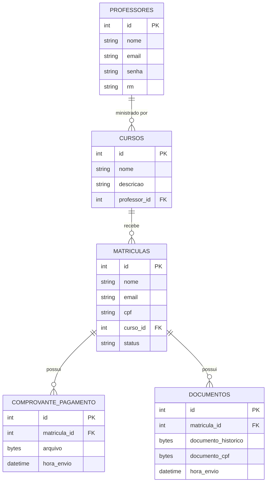

#  Sistema de Gestão Escolar : TIVIT Academy

Este repositório contém o **frontend completo** de um Sistema de Gestão Escolar moderno, desenvolvido em **HTML, CSS e JavaScript**, com foco em usabilidade, modularidade e expansão futura.

O sistema permite que **alunos realizem matrícula**, **professores gerenciem turmas** e **administradores administrem toda a plataforma**. Em breve ocorrerá a integração com o **backend em C#, .NET e SQL Server**.

---

## 📖 Documentação

A documentação completa do projeto, incluindo detalhes dos endpoints, instalação e arquitetura, está disponível na pasta `docs`.

👉 [Acesse a Documentação Completa](https://luccasirineu.github.io/)

#  Funcionalidades Implementadas

## 🔹 1. Processo de Matrícula

* Tela de cadastro do aluno
* Coleta de dados: nome, email, CPF, curso escolhido
* Após finalizar, os dados são enviados para a área administrativa
* Arquitetado para que o **admin crie o usuário** utilizando os dados enviados pelo aluno

## 🔹 2. Dashboard do Aluno

* Acesso ao perfil
* Visualização da desempenho
* Área de cursos e turmas
* Informações do calendário escolar

## 🔹 3. Dashboard do Professor

* Visualização das turmas
* Gerenciamento de alunos dentro da turma
* Integração futura com backend para chamadas, desempenho, materiais etc.

## 🔹 4. Dashboard do Administrador

* Gerenciamento de alunos
* Gerenciamento de professores
* Gerenciamento de cursos e turmas
* Aprovação e criação de usuários com base nas matrículas finalizadas

---

# Arquitetura Frontend

* Estrutura organizada em **páginas**, **componentes** e **controladores**
* Layout responsivo
* Código preparado para integração via API REST

---

#  Banco de Dados — Diagrama (DER)

Abaixo está o diagrama das tabelas do banco de dados.

---

# Integração Futura (Backend .NET + SQL Server)

A integração irá permitir:

* Persistência real dos dados
* Autenticação segura
* CRUD completo de alunos, turmas, cursos e matrículas
* Geração automática de RM
* Dashboard dinâmico com dados reais

A comunicação será feita via **API RESTful**.

---

# Tecnologias Utilizadas

* HTML5
* CSS3
* JavaScript
* C# .NET + SQL Server

---

# 📌 Próximos Passos

* Integração com backend
* Melhorias no fluxo de matrícula
* Autenticação JWT
* Permissões por nível de usuário
* Dashboard com gráficos e dados reais

---
