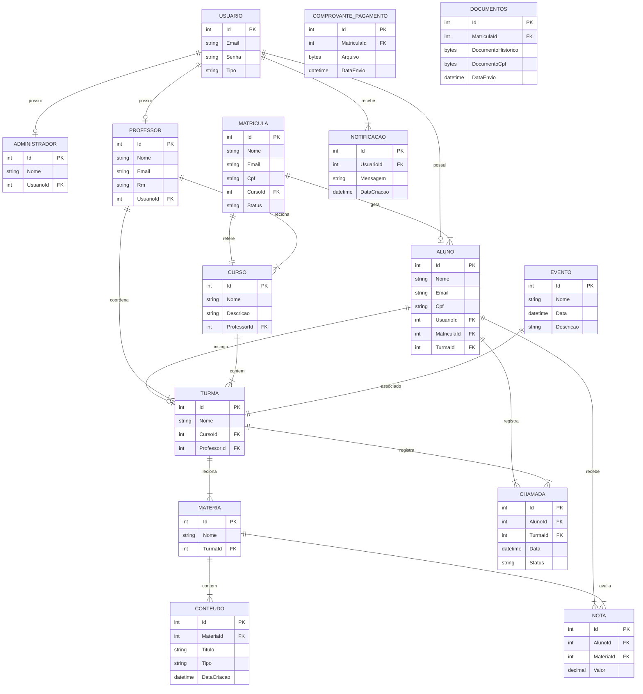

# 🎓 TIVIT Academy - Sistema de Gestão Escolar

Um sistema completo e moderno de gestão escolar desenvolvido com **C# .NET 9** no backend e **React + TypeScript + Vite** no frontend, com suporte a múltiplos papéis de usuário (Aluno, Professor, Administrador) e integração com AWS SQS.

---

## 📋 Visão Geral

O **TIVIT Academy** é uma plataforma educacional robusta que permite:

- ✅ **Alunos**: Realizar matrícula, visualizar desempenho, acessar disciplinas e calendário escolar
- ✅ **Professores**: Gerenciar turmas, registrar chamadas, lançar notas e compartilhar conteúdo
- ✅ **Administradores**: Gerenciar usuários, cursos, turmas, aprovações de matrículas e notificações

---

## 🏗️ Arquitetura do Projeto

```
Projeto/
├── backend/               # API REST em C# .NET 9
│   └── tivitApi/
│       ├── Controllers/   # 13 Controladores REST
│       ├── Models/        # 15 Modelos de dados
│       ├── Services/      # Serviços de negócio
│       ├── DTOs/          # Data Transfer Objects
│       ├── Data/          # Entity Framework DbContext
│       ├── Migrations/    # Versionamento do banco
│       └── Utils/         # Utilitários (hash, validação)
│
├── frontend/              # Frontend React + TypeScript
│   └── src/
│       ├── pages/         # Dashboard (Aluno, Professor, Admin)
│       ├── components/    # Componentes reutilizáveis
│       ├── layout/        # Layouts por papel
│       ├── context/       # Autenticação (Context API)
│       ├── hooks/         # Hooks customizados
│       ├── services/      # Cliente API (Axios)
│       ├── schemas/       # Validação (Zod)
│       └── types/         # TypeScript types
│
└── docs/                  # Documentação do projeto
```

---

## 💾 Banco de Dados

O projeto utiliza **SQL Server** com Entity Framework Core. O diagrama abaixo mostra as principais entidades:


```mermaid
erDiagram

    USUARIO {
        int Id PK
        string Email
        string Senha
        string Tipo
    }

    ADMINISTRADOR {
        int Id PK
        string Nome
        int UsuarioId FK
    }

    PROFESSOR {
        int Id PK
        string Nome
        string Email
        string Rm
        int UsuarioId FK
    }

    ALUNO {
        int Id PK
        string Nome
        string Email
        string Cpf
        int UsuarioId FK
        int MatriculaId FK
        int TurmaId FK
    }

    MATRICULA {
        int Id PK
        string Nome
        string Email
        string Cpf
        int CursoId FK
        string Status
    }

    COMPROVANTE_PAGAMENTO {
        int Id PK
        int MatriculaId FK
        bytes Arquivo
        datetime DataEnvio
    }

    DOCUMENTOS {
        int Id PK
        int MatriculaId FK
        bytes DocumentoHistorico
        bytes DocumentoCpf
        datetime DataEnvio
    }

    CURSO {
        int Id PK
        string Nome
        string Descricao
        int ProfessorId FK
    }

    TURMA {
        int Id PK
        string Nome
        int CursoId FK
        int ProfessorId FK
    }

    MATERIA {
        int Id PK
        string Nome
        int TurmaId FK
    }

    EVENTO {
        int Id PK
        string Nome
        datetime Data
        string Descricao
    }

    CHAMADA {
        int Id PK
        int AlunoId FK
        int TurmaId FK
        datetime Data
        string Status
    }

    NOTA {
        int Id PK
        int AlunoId FK
        int MateriaId FK
        decimal Valor
    }

    CONTEUDO {
        int Id PK
        int MateriaId FK
        string Titulo
        string Tipo
        datetime DataCriacao
    }

    NOTIFICACAO {
        int Id PK
        int UsuarioId FK
        string Mensagem
        datetime DataCriacao
    }

    %% Relacionamentos
    USUARIO ||--o| ALUNO : possui
    USUARIO ||--o| PROFESSOR : possui
    USUARIO ||--o| ADMINISTRADOR : possui
    
    MATRICULA ||--|{ ALUNO : gera
    MATRICULA ||--|| CURSO : refere
    ALUNO ||--o| TURMA : inscrito
    ALUNO ||--|{ CHAMADA : registra
    ALUNO ||--|{ NOTA : recebe
    
    PROFESSOR ||--|{ CURSO : leciona
    PROFESSOR ||--|{ TURMA : coordena
    
    CURSO ||--|{ TURMA : contem
    TURMA ||--|{ MATERIA : leciona
    TURMA ||--|{ CHAMADA : registra
    
    MATERIA ||--|{ CONTEUDO : contem
    MATERIA ||--|{ NOTA : avalia
    
    EVENTO ||--|| TURMA : associado
    
    USUARIO ||--|{ NOTIFICACAO : recebe
```

---

## 🚀 Tech Stack

### Backend
- **Runtime**: .NET 9.0
- **ORM**: Entity Framework Core 9.0
- **Banco de Dados**: SQL Server
- **Autenticação**: JWT Bearer
- **Hashing**: BCrypt.Net-Next
- **Mapeamento**: AutoMapper
- **Geração de PDFs**: QuestPDF
- **Fila de Mensagens**: AWS SQS SDK
- **Logging**: Built-in Microsoft.Extensions.Logging

### Frontend
- **Framework**: React 18.3.1
- **Linguagem**: TypeScript 5.9
- **Build Tool**: Vite 7.3.1
- **Roteamento**: React Router 7.13.1
- **HTTP Client**: Axios 1.13.5
- **Validação**: Zod 3.22.4
- **Gráficos**: Recharts 3.7.0
- **Notificações**: React Hot Toast 2.4.1
- **Testes**: Vitest + React Testing Library
- **Linting**: ESLint 9.39.1

---

## 📦 Funcionalidades Implementadas

### 1️⃣ Sistema de Autenticação
- ✅ Login com email e senha
- ✅ Autenticação JWT com expiração (8 horas)
- ✅ Roles (Aluno, Professor, Administrador)
- ✅ Hash de senhas com BCrypt
- ✅ Context API para gerenciar sessão

### 2️⃣ Matrícula de Alunos
- ✅ Formulário de pré-inscrição
- ✅ Coleta de dados pessoais e escolha de curso
- ✅ Upload de comprovante de pagamento
- ✅ Upload de documentos (CPF, histórico)
- ✅ Fila de processamento com AWS SQS
- ✅ Aprovação e criação de usuário pelo admin

### 3️⃣ Dashboard do Aluno
- ✅ Visualização de perfil
- ✅ Acompanhamento de desempenho com gráficos
- ✅ Listagem de disciplinas e turmas
- ✅ Calendário escolar interativo
- ✅ Consulta de notas por disciplina
- ✅ Central de notificações
- ✅ Relatórios de desempenho em PDF

### 4️⃣ Dashboard do Professor
- ✅ Visualização de turmas ministradas
- ✅ Gerenciamento de alunos por turma
- ✅ Registro de chamadas
- ✅ Lançamento de notas
- ✅ Compartilhamento de conteúdo (links e PDFs)
- ✅ Calendário de eventos
- ✅ Boletins com relatório de desempenho
- ✅ Notificações para alunos

### 5️⃣ Dashboard do Administrador
- ✅ Aprovação de matrículas pendentes
- ✅ Gerenciamento completo de usuários
- ✅ Cadastro e edição de cursos
- ✅ Gerenciamento de turmas
- ✅ Cadastro de professores
- ✅ Visualização e gerenciamento de alunos
- ✅ Centro de notificações
- ✅ Relatórios do sistema

### 6️⃣ Sistema de Notificações
- ✅ Notificações em tempo real (Toasts)
- ✅ Centro de notificações persistente
- ✅ Notificações por papel (aluno, professor, admin)
- ✅ Integração com AWS SQS para eventos assíncronos

### 7️⃣ Recursos Adicionais
- ✅ Modo claro/escuro
- ✅ Interface responsiva
- ✅ Mensagens de erro detalhadas
- ✅ Estados de carregamento
- ✅ Validação de formulários (Zod)
- ✅ Testes unitários (Vitest)

---


## 📡 API REST - Endpoints Principais

### Autenticação
```
POST   /api/login              - Fazer login
GET    /api/user/me            - Obter usuário atual
```

### Alunos
```
GET    /api/aluno/{id}                  - Obter informações do aluno
GET    /api/aluno/getAllAlunosByCurso   - Listar alunos por curso
POST   /api/aluno                       - Criar aluno
PUT    /api/aluno/{id}                  - Atualizar aluno
```

### Cursos
```
GET    /api/curso                       - Listar cursos
GET    /api/curso/{id}                  - Obter curso específico
POST   /api/curso                       - Criar curso (Admin)
PUT    /api/curso/{id}                  - Atualizar curso (Admin)
DELETE /api/curso/{id}                  - Deletar curso (Admin)
```

### Turmas
```
GET    /api/turma                       - Listar turmas
GET    /api/turma/{id}                  - Obter turma específica
POST   /api/turma                       - Criar turma (Admin)
PUT    /api/turma/{id}                  - Atualizar turma (Admin)
```

### Matrículas
```
GET    /api/matricula                       - Listar matrículas
POST   /api/matricula                       - Criar matrícula
GET    /api/matricula/pendentes             - Matrículas pendentes (Admin)
PUT    /api/matricula/{id}/aprovar          - Aprovar matrícula (Admin)
POST   /api/matricula/{id}/comprovante      - Upload comprovante
POST   /api/matricula/{id}/documentos       - Upload documentos
```

### Professores
```
GET    /api/professor                       - Listar professores
GET    /api/professor/{id}                  - Obter professor
POST   /api/professor                       - Criar professor (Admin)
PUT    /api/professor/{id}                  - Atualizar professor
```

### Notas
```
GET    /api/nota/{alunoId}               - Obter notas do aluno
POST   /api/nota                         - Lançar nota (Professor)
PUT    /api/nota/{id}                    - Atualizar nota (Professor)
```

### Chamadas
```
GET    /api/chamada/turma/{turmaId}      - Listar chamadas da turma
POST   /api/chamada                      - Registrar chamada (Professor)
```

### Notificações
```
GET    /api/notificacao                  - Listar notificações
POST   /api/notificacao                  - Criar notificação (Admin)
```

### Conteúdo
```
GET    /api/conteudo/materia/{materiaId} - Listar conteúdo
POST   /api/conteudo/link                - Upload de link
POST   /api/conteudo/pdf                 - Upload de PDF
```

---

---

## 🔐 Segurança

- ✅ Autenticação JWT com validação de token
- ✅ Hash de senhas com BCrypt
- ✅ CORS configurado
- ✅ Autorização por roles (Aluno, Professor, Admin)
- ✅ Validação de entrada com Zod (Frontend) e FluentValidation (Backend)
- ✅ Tratamento centralizado de exceções

---

## 📁 Estrutura de Pastas Detalhada

### Backend
```
Controllers/       - 13 controladores para endpoints REST
Models/           - 15 modelos (Aluno, Professor, Curso, etc.)
Services/         - Lógica de negócio (Interface + Implementação)
DTOs/             - 30+ Data Transfer Objects
Data/             - DbContext e configuração EF
Migrations/       - Histórico de mudanças no banco
Exceptions/       - Exceções customizadas
Utils/            - Utilitários (Hash, Token, Validação)
Infra/            - Integração AWS SQS
```

### Frontend
```
pages/            - Dashboard por papel (Aluno, Professor, Admin)
components/       - Componentes reutilizáveis (Modal, Loading, etc.)
layout/           - Layouts específicos por papel
context/          - Context API (Autenticação, Tema)
hooks/            - Hooks customizados (useErrorHandler, useAluno, etc.)
services/         - Cliente API com Axios
schemas/          - Validação Zod e tipos TypeScript
tests/            - Testes unitários e setup
types/            - Tipos TypeScript globais
constants/        - Constantes da aplicação
```

---

## 📊 Modelos de Dados Principais

| Entidade | Descrição |
|----------|-----------|
| **Usuário** | Base para autenticação (Email, Senha, Tipo) |
| **Aluno** | Dados do aluno (Nome, CPF, Email, Desempenho) |
| **Professor** | Dados do professor (Nome, RM, Email) |
| **Administrador** | Acesso administrativo (Nome, Email) |
| **Curso** | Curso oferecido (Nome, Descrição, Professor) |
| **Turma** | Turma de um curso (Nome, Curso, Professor) |
| **Matéria** | Disciplina da turma (Nome, Conteúdo) |
| **Matrícula** | Solicitação de inscrição (Status, Documentos) |
| **Nota** | Desempenho do aluno (Valor, Matéria) |
| **Chamada** | Presença do aluno (Data, Status) |
| **Notificação** | Mensagens para usuários |
| **Evento** | Eventos escolares (Data, Descrição) |
| **Conteúdo** | Materiais de aula (PDF, Links) |

---

## 🤝 Padrões de Desenvolvimento

### Backend
- **Padrão**: Repository + Service + DTO
- **Injeção**: Dependency Injection (Microsoft.Extensions.DependencyInjection)
- **Validação**: Data Annotations + Custom Exceptions
- **Logging**: Microsoft.Extensions.Logging

### Frontend
- **Padrão**: React Hooks + Context API
- **Estilo**: CSS Modules + Componentes
- **Requisições**: Axios com interceptors
- **Forma**: Controlled Components + Zod


---

## 📚 Documentação Adicional

Para mais detalhes sobre endpoints, modelos e arquitetura, consulte a documentação em:
👉 [Documentação Completa](./docs/index.md)

---

## 📄 Licença

Este projeto é desenvolvido para fins educacionais.

---

## 👨‍💻 Autor

**TIVIT Academy**  
Desenvolvido como sistema de gestão educacional completo.

---

## ✨ Status do Projeto

- ✅ Backend: Em produção
- ✅ Frontend: Em produção
- ✅ Banco de dados: SQL Server estruturado
- ✅ Autenticação JWT: Implementada
- ✅ Autorização por papéis: Implementada
- ✅ Integração AWS SQS: Implementada
-  ✅ Testes: Parcialmente implementados
    PROFESSORES ||--o{ CURSOS : "ministrado por"
    CURSOS ||--o{ MATRICULAS : "recebe"
    MATRICULAS ||--o{ COMPROVANTE_PAGAMENTO : "possui"
    MATRICULAS ||--o{ DOCUMENTOS : "possui"

```


