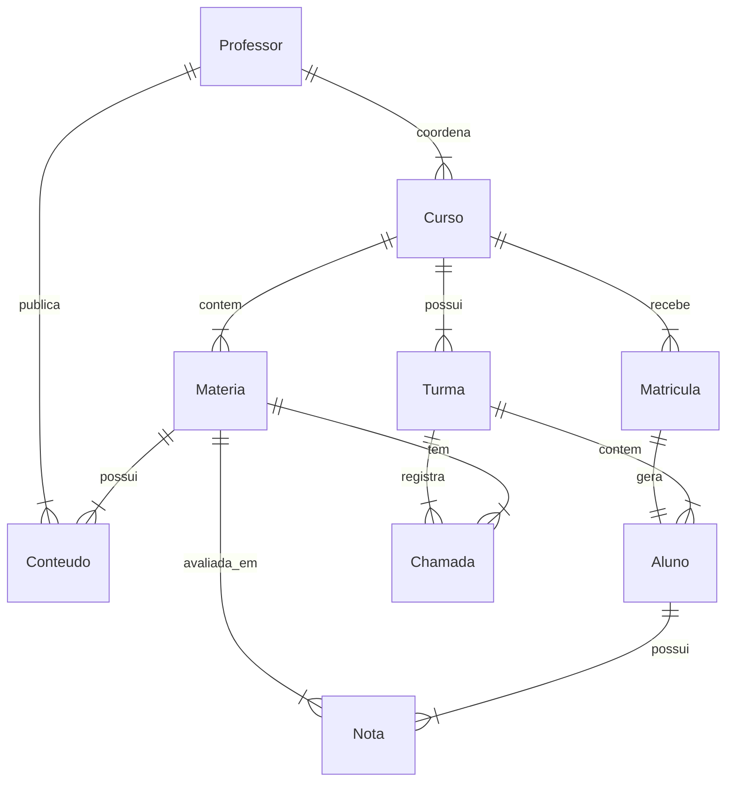

# 📚 Tivit Academy API Documentation

Bem-vindo à documentação oficial da API **Tivit Academy**. Este projeto é uma API RESTful desenvolvida em .NET 9.0, projetada para gerenciar um sistema acadêmico, incluindo alunos, professores, cursos, matrículas, notas, chamadas e eventos.

---

## 🚀 Visão Geral

O sistema **Tivit Academy** é uma solução backend robusta que gerencia o ciclo de vida acadêmico. Ele oferece endpoints para administração de cursos, controle de frequência, lançamento de notas e gestão de documentos de matrícula. A arquitetura segue padrões modernos com separação de responsabilidades em Controllers, Services e Repositories (via Entity Framework Core).

### 🛠️ Tecnologias Utilizadas

*   **Framework:** .NET 9.0 (C#)
*   **Banco de Dados:** SQL Server (Entity Framework Core)
*   **ORM:** EF Core 9.0 (Code First)
*   **Mapeamento:** AutoMapper
*   **Mensageria:** AWS SQS (Integração para eventos assíncronos)
*   **Documentação API:** Swagger / OpenAPI
*   **Autenticação:** Custom Login Service (Simples)

---

## ⚙️ Configuração e Instalação

### Pré-requisitos

*   [.NET 9.0 SDK](https://dotnet.microsoft.com/download/dotnet/9.0)
*   SQL Server (LocalDB ou instância dedicada)
*   AWS CLI configurado (opcional, para funcionalidades SQS)

### Passo a Passo

1.  **Clone o repositório:**
    ```bash
    git clone https://github.com/seu-usuario/tivit-academy.git
    cd tivit-academy/backend/tivitApi
    ```

2.  **Configure o Banco de Dados:**
    Verifique a string de conexão em `appsettings.json`. O padrão utiliza LocalDB:
    ```json
    "ConnectionStrings": {
      "DefaultConnection": "Server=(localdb)\MSSQLLocalDB;Database=TivitDB;Trusted_Connection=True;"
    }
    ```

3.  **Execute as Migrations:**
    ```bash
    dotnet ef database update
    ```

4.  **Inicie a Aplicação:**
    ```bash
    dotnet run
    ```
    A API estará acessível em `http://localhost:5027` (ou porta configurada).

---

## 📡 Endpoints da API

A API é dividida nos seguintes controladores principais:

### 🎓 Aluno (`/api/Aluno`)
Gerencia informações dos alunos.
*   `GET /contextMe/{alunoId}`: Obtém detalhes do aluno logado.
*   `GET /getAllAlunosByCurso/{cursoId}`: Lista alunos de um curso específico.
*   `GET /getAllAlunosByTurmaId/{turmaId}`: Lista alunos de uma turma.
*   `GET /getQntdAlunosAtivos`: Retorna contagem de alunos ativos.

### 🏫 Turma (`/api/Turma`)
Gerencia as turmas dos cursos.
*   `POST /criarTurma`: Cria uma nova turma.
*   `GET /getAllTurmas`: Lista todas as turmas.
*   `GET /getTurmasByCursoId/{cursoId}`: Busca turmas por curso.

### 📝 Matricula (`/api/Matricula`)
Processo de inscrição e aprovação de alunos.
*   `POST /`: Inicia uma nova matrícula.
*   `POST /{matriculaId}/pagamento`: Envia comprovante de pagamento.
*   `POST /{matriculaId}/documentos`: Envia documentos (Histórico/CPF).
*   `POST /aprovar/{matriculaId}`: Aprova uma matrícula (Gera aluno e envia evento SQS).
*   `GET /getAllMatriculasPendentes`: Lista matrículas aguardando aprovação.

### 👨‍🏫 Professor (`/api/Professor`)
Gestão do corpo docente.
*   `GET /getAllProfessores`: Lista todos os professores.
*   `GET /getProfessorById/{professorId}`: Detalhes de um professor.

### 📚 Curso & Matéria (`/api/Curso`, `/api/Materia`)
Estrutura pedagógica.
*   `GET /api/Curso`: Lista todos os cursos.
*   `POST /api/Curso/criarCurso`: Cria um novo curso.
*   `POST /api/Materia/criarMateria`: Adiciona uma matéria a um curso.
*   `GET /api/Materia/getMateriasByCursoId/{cursoId}`: Grade curricular.

### 📊 Notas & Chamadas (`/api/Nota`, `/api/Chamada`)
Desempenho e frequência.
*   `POST /api/Nota/adicionarNota`: Lança notas (Nota 1 e Nota 2).
*   `GET /api/Nota/aluno/{alunoId}/getDesempenho`: Retorna média e status (Ouro/Prata/Bronze).
*   `POST /api/Chamada/realizarChamada`: Registra presença/falta para uma lista de alunos.

### 📅 Eventos (`/api/Evento`)
Calendário acadêmico.
*   `POST /adicionarEvento`: Cria um novo evento no calendário.
*   `GET /proximoEvento`: Retorna o próximo evento agendado.

### 📂 Conteúdos (`/api/Conteudo`)
Materiais de aula.
*   `POST /upload/pdf`: Upload de arquivos PDF para uma matéria.
*   `POST /upload/link`: Cadastro de links externos.

---

## 🗄️ Esquema do Banco de Dados

O diagrama abaixo ilustra os principais relacionamentos do sistema:



---

## ☁️ Integração AWS

O sistema utiliza **AWS SQS** para comunicação assíncrona.
*   **Fila:** `matriculas-events-queue`
*   **Eventos:** Quando uma matrícula é aprovada ou recusada, um evento é publicado na fila para processamento posterior (ex: envio de e-mail).

---

## 🔐 Autenticação

O sistema possui um `LoginService` simples que valida credenciais para três tipos de usuários:
1.  **Aluno**
2.  **Professor**
3.  **Administrador**

---

Desenvolvido por **Luccas Irineu** | Tivit Academy
